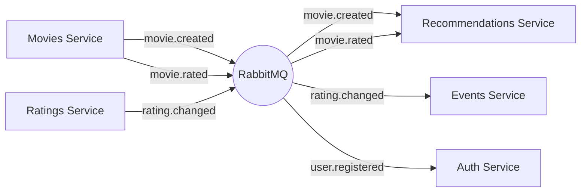

# 🎬 CineMatch — Рекомендательная система фильмов

## 📋 О проекте

**CineMatch** — это учебный микросервисный проект, демонстрирующий современные **архитектурные паттерны** и **полиглотную архитектуру** баз данных. Проект разработан в рамках курса по архитектуре ПО.

### 🏗️ Ключевые архитектурные решения

| Паттерн | Реализация |
|---------|------------|
| **Микросервисная архитектура** | 5 независимых сервисов, каждый со своей БД |
| **Domain-Driven Design (DDD)** | Чёткое выделение Entities, Value Objects, Aggregates |
| **CQRS** | Разделение команд и запросов (в процессе) |
| **Event-Driven Architecture** | RabbitMQ для асинхронной коммуникации |
| **Clean Architecture** | Разделение на domain, application, infrastructure слои |

## 🗄️ Полиглотная архитектура баз данных

| Сервис | База данных | Назначение | Паттерн |
|--------|-------------|------------|---------|
| **movies-service** | PostgreSQL + Neo4j + Redis | Фильмы, граф связей, кэш | Repository + Identity Map |
| **auth-service** | PostgreSQL | Пользователи, аутентификация | Repository + Unit of Work |
| **ratings-service** | PostgreSQL + Redis | Оценки, рейтинги | CQRS + Event Sourcing |
| **recommendations-service** | Qdrant + Redis | Векторные рекомендации | Стратегия + Спецификация |
| **events-service** | MongoDB | Логи действий, аналитика | Event Sourcing |

## 🔄 Event-Driven Architecture (RabbitMQ)

## 📊 Топики и очереди
Exchange	Routing Key	Подписчики	Событие
cinematch.movies	movie.created	recommendations, events	Новый фильм
cinematch.movies	movie.rated	recommendations, events	Оценка фильма
cinematch.movies	movie.viewed	events	Просмотр
cinematch.ratings	rating.changed	movies, events	Изменение рейтинга
cinematch.auth	user.registered	events	Новый пользователь
## 🏛️ DDD (Domain-Driven Design) в каждом сервисе
services/movies/
├── src/
│   ├── domain/                      # Ядро предметной области
│   │   ├── entities/                 # Movie, User (с идентификаторами)
│   │   ├── value_objects/            # MovieTitle, Year, Rating (immutable)
│   │   ├── aggregates/               # MovieAggregate (корень агрегата)
│   │   ├── events/                   # MovieCreated, MovieRated
│   │   └── repositories/             # Интерфейсы репозиториев
│   ├── application/                  # Сценарии использования
│   │   ├── commands/                  # CreateMovieCommand
│   │   ├── queries/                    # GetMovieQuery
│   │   └── use_cases/                  # RecommendSimilarMovies
│   ├── infrastructure/                # Технические детали
│   │   ├── repositories/               # Реализации репозиториев
│   │   └── message_bus/                # RabbitMQ адаптеры
│   └── interfaces/                    # API слой
│       └── http/                        # Flask routes
# 🚀 Быстрый старт
Требования:
Python 3.9+
Docker и Docker Compose
Git

Установка и запуск
bash
## 1. Клонируем репозиторий
git clone https://github.com/Evgeniy3252834/cinema.git
cd cinema

## 2. Создаём виртуальное окружение
python -m venv venv
source venv/bin/activate  # Linux/Mac
## или
venv\Scripts\activate     # Windows

## 3. Устанавливаем зависимости
pip install -r requirements.txt

## 4. Создаём файл с переменными окружения
cp .env.example .env
## Отредактируйте .env под свои параметры

## 5. Запускаем все сервисы одной командой
docker-compose up -d

## 6. Инициализируем базы данных
docker exec -it cinematch-postgres psql -U postgres -d cinematch -f init.sql

## 7. Запускаем микросервисы (в отдельных терминалах)
python services/movies/app.py      # порт 5002
python services/auth/app.py        # порт 5001
python services/ratings/app.py     # порт 5003
python services/recommendations/app.py  # порт 5004
python services/events/app.py      # порт 5005
# 📡 API Endpoints
Movies Service (порт 5002)
Метод	Endpoint	Описание	Событие
GET	/api/movies/	Все фильмы	-
GET	/api/movies/<id>	Детали фильма	movie.viewed
POST	/api/movies/	Создать фильм	movie.created
GET	/api/movies/<id>/actors	Актёры фильма	-
GET	/api/movies/actors/<name>/movies	Фильмы актёра	-
GET	/api/movies/top-views	Топ по просмотрам	-
Другие сервисы (будут добавлены)
# 🧪 Примеры запросов
## Получить все фильмы
curl http://localhost:5002/api/movies/

## Создать новый фильм (публикует событие movie.created)
curl -X POST http://localhost:5002/api/movies/ \
  -H "Content-Type: application/json" \
  -d '{
    "title": "Inception",
    "year": 2010,
    "director": "Christopher Nolan",
    "actors": ["Leonardo DiCaprio", "Joseph Gordon-Levitt"]
  }'

## Получить актёров фильма
curl http://localhost:5002/api/movies/1/actors

## Проверить RabbitMQ веб-интерфейс
http://localhost:15672 (admin/admin)

# 📄 Лицензия
MIT License — свободно используйте для обучения и разработки.

# 👨‍💻 Авторы
Овчинников Евгений, Михайлов Сергей — учебный проект по курсу "Архитектура ПО"

⭐ Если проект полезен, поставьте звезду на GitHub!
